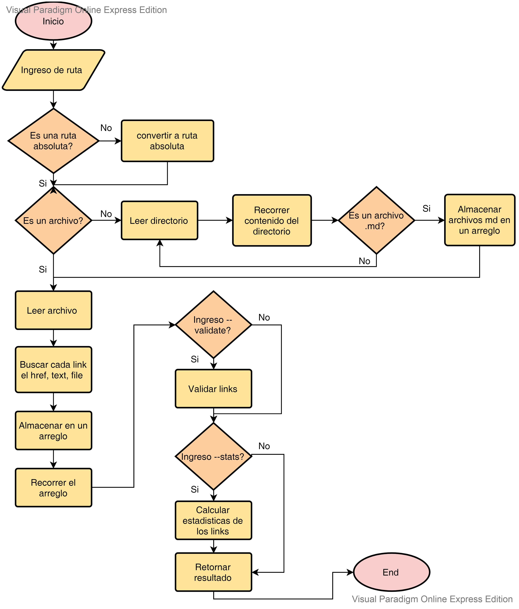

# Mardown Links

Es una herramienta creada usando Node.js, que lee y analiza archivos en formato Markdown, para verificar los links que contengan y reportar algunas estadísticas.

## Diagrama de flujo

## Documentación técnica de la librería:

El módulo es instalable via npm install MariangelMM/LIM011-fe-md-links -g . Este módulo también se puede incluir un ejecutable que podamos invocar en la línea de comando como una interfaz que podamos importar con require para usarlo programáticamente.

#### Argumentos:

path: Ruta absoluta o relativa al archivo o directorio. Si la ruta pasada es relativa, debe resolverse como relativa al directorio desde donde se invoca.

options: Un objeto con las siguientes propiedades:

validate: Booleano que determina si se desea validar los links encontrados.

#### Valor de retorno
La función debe retornar una promesa (Promise) que resuelva a un arreglo (Array) de objetos (Object), donde cada objeto representa un link y contiene las siguientes propiedades:

href: URL encontrada.

text: Texto que aparecía dentro del link (a).

file: Ruta del archivo donde se encontró el link.

#### Ejemplo

Crear un archivo .js

// Dentro del archivo creado, colocar

const mdLinks = require("md-links");

mdLinks("./some/example.md")

  .then(links => {
    // => [{ href, text, file }]
  })

  .catch(console.error);

mdLinks("./some/example.md", { validate: true })

  .then(links => {
    // => [{ href, text, file, status, ok }]
  })

  .catch(console.error);

mdLinks("./some/dir")

  .then(links => {
    // => [{ href, text, file }]
  })
  
  .catch(console.error);

### Guía de uso e instalación de la librería

Módulo instalable via

npm install MariangelMM/LIM011-fe-md-links -g

Este módulo es ejecutable como una interfaz que podamos importar con require para usarlo programáticamente.

Uso

El ejecutable de nuestra aplicación puede ejecutarse de la siguiente manera a través de la terminal:

md-links 'path-to-file' [options]

Options:

--validate

Si pasamos la opción --validate, el módulo debe hacer una petición HTTP para averiguar si el link funciona o no. Si el link resulta en una redirección a una URL que responde ok, entonces consideraremos el link como ok.

Por ejemplo:

$ md-links ./some/example.md --validate

./some/example.md http://algo.com/2/3/ ok 200 Link a algo

./some/example.md https://otra-cosa.net/algun-doc.html fail 404 algún doc

./some/example.md http://google.com/ ok 301 Google

--stats

Si pasamos la opción --stats el output (salida) será un texto con estadísticas básicas sobre los links.

$ md-links ./some/example.md --stats

Total: 3

Unique: 3

También podemos combinar --stats y --validate para obtener estadísticas que necesiten de los resultados de la validación.

$ md-links ./some/example.md --stats --validate

Total: 3

Unique: 3,

Broken: 1

### Javascript
- [ ] Uso de callbacks
- [ ] Consumo de Promesas
- [ ] Creacion de Promesas
- [ ] Modulos de Js
- [ ] Recursión

### Node
- [ ] Sistema de archivos
- [ ] package.json
- [ ] crear modules
- [ ] Instalar y usar modules
- [ ] npm scripts
- [ ] CLI (Command Line Interface - Interfaz de Línea de Comando)

### Testing
- [ ] Testeo de tus funciones
- [ ] Testeo asíncrono
- [ ] Uso de librerias de Mock
- [ ] Mocks manuales
- [ ] Testeo para multiples Sistemas Operativos

### Git y Github
- [ ] Organización en Github

### Buenas prácticas de desarrollo
- [ ] Modularización
- [ ] Nomenclatura / Semántica
- [ ] Linting

*